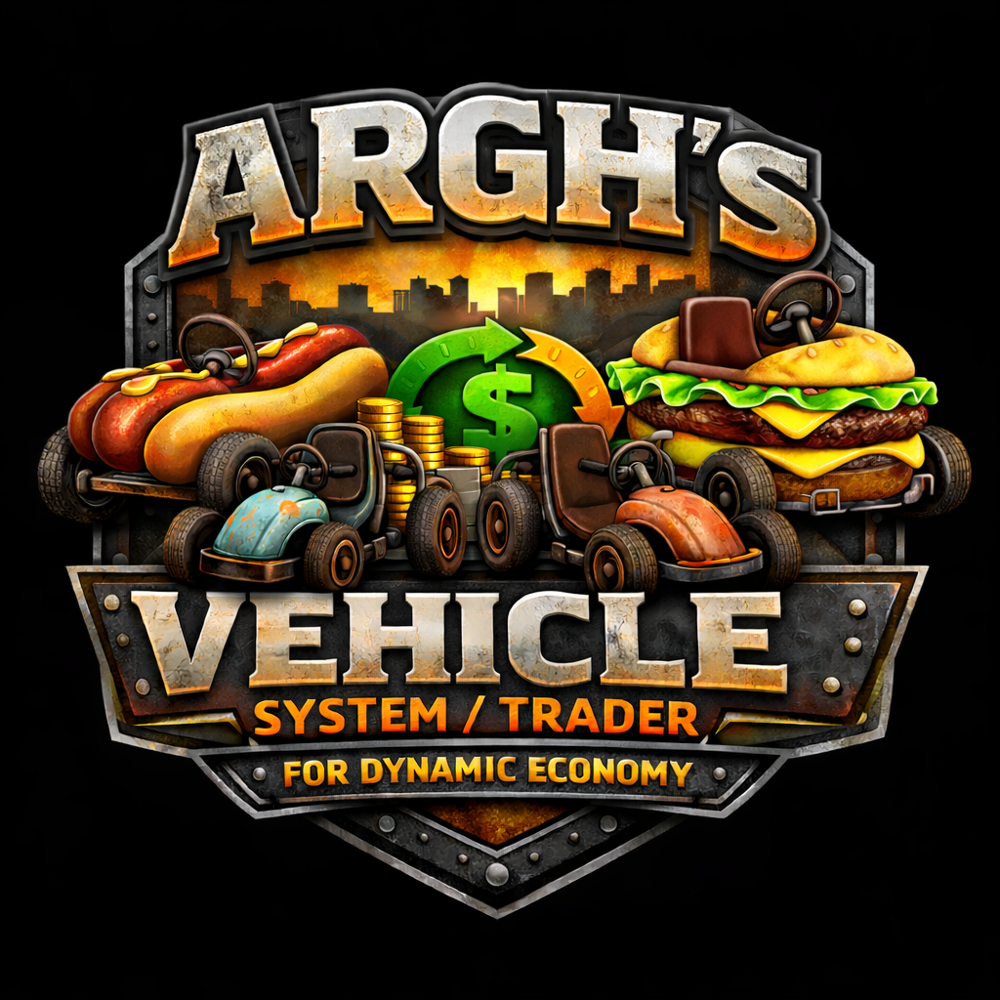
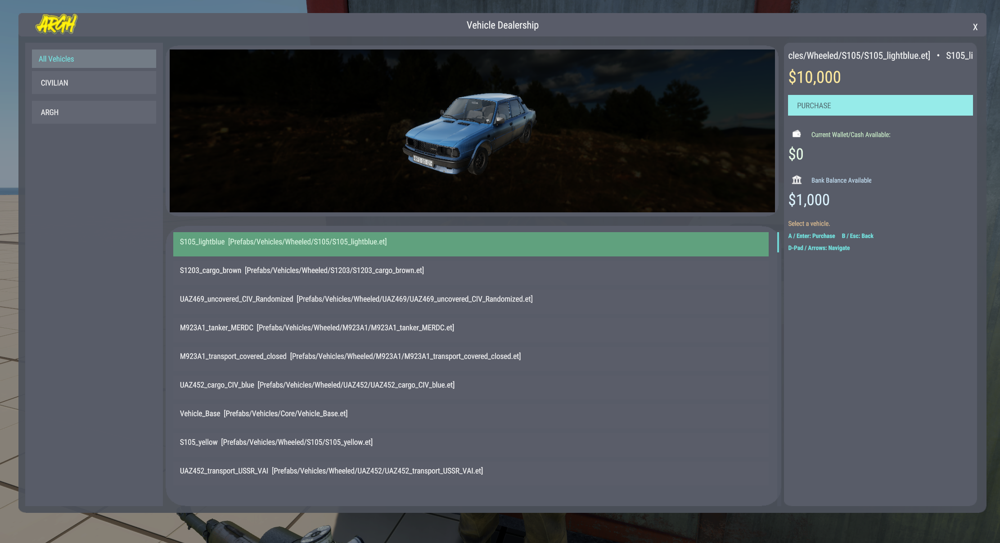
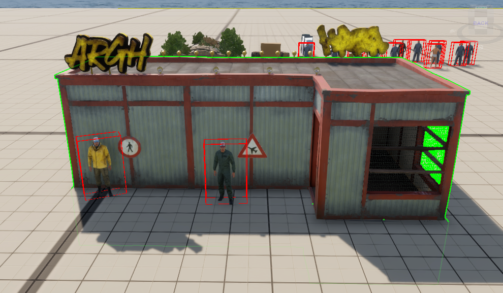
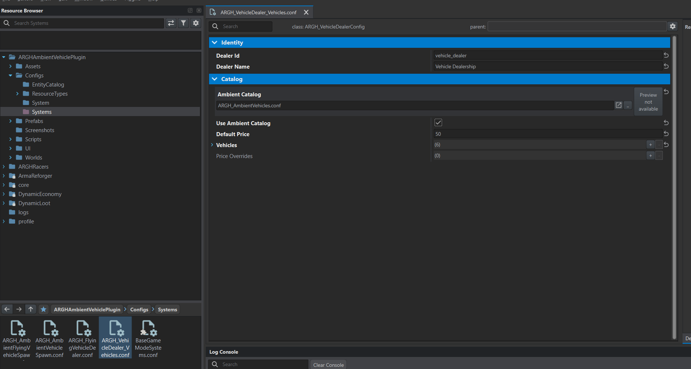
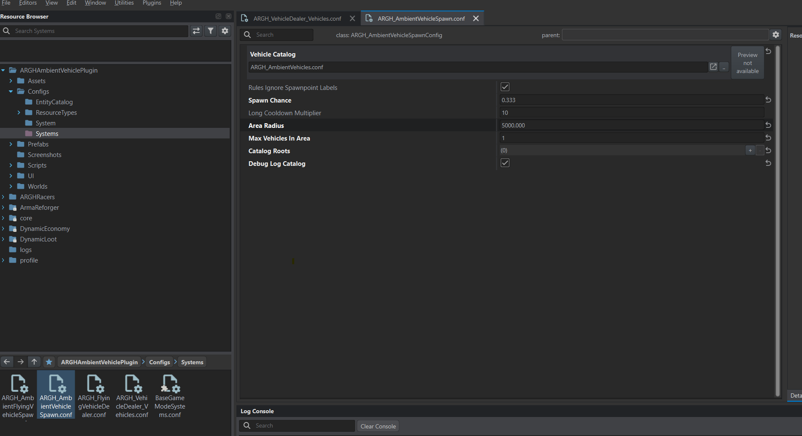
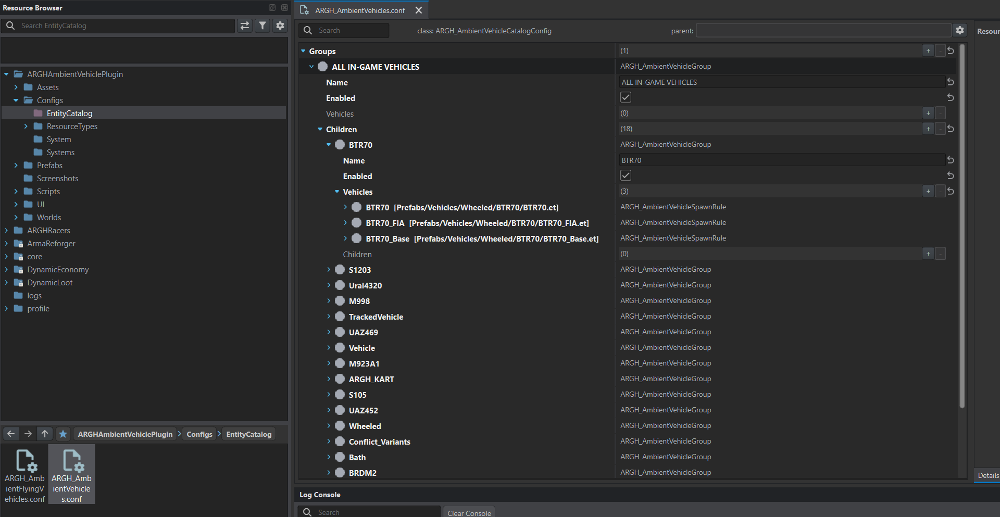
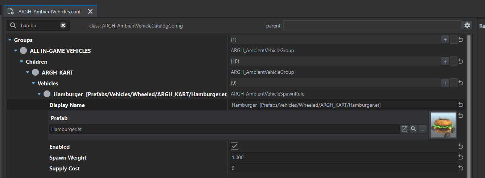
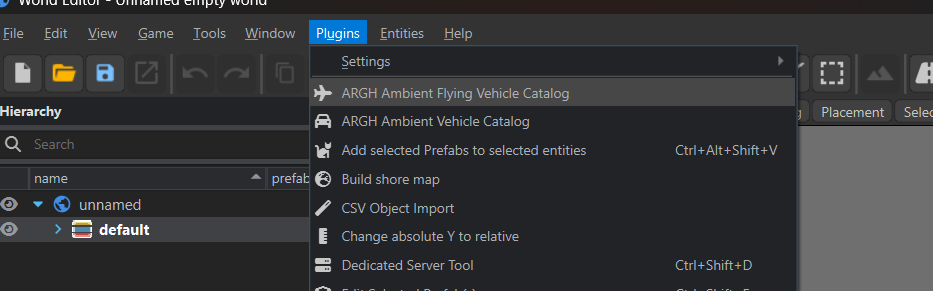
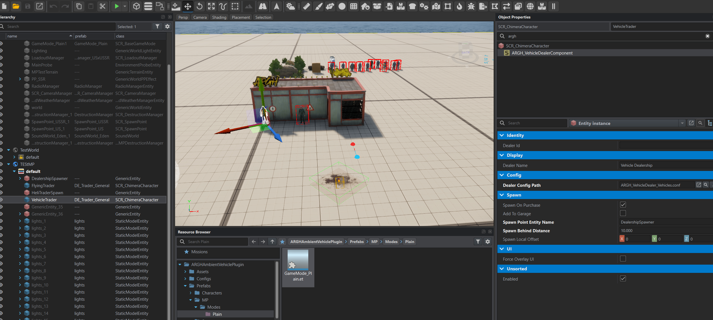

<p align="center">
  
</p>

# ARGH Ambient Vehicle Plugin

Friendly user guide for ambient vehicle spawning and the ARGH vehicle dealer.

## Contents
- What This Mod Does
- Requirements
- Quick Start (Dealer)
- Dealer Config (Main Settings)
- Set Price For Every Vehicle (Default Price)
- Set Price Per Vehicle (Catalog Override)
- Spawn Behavior (Where Purchased Vehicles Appear)
- Buy Cooldown (Rate Limit)
- UI Feedback
- Ambient Vehicle Catalogs (Ground + Flying)
- Troubleshooting

## What This Mod Does
- Spawns ambient ground and flying vehicles using editable catalogs.
- Adds a vehicle dealer (menu + overlay) that sells vehicles for cash.
- Supports DynamicEconomy wallet + bank payments.
- Lets you set a single price for all vehicles or per-vehicle prices.

## Requirements
- Arma Reforger (Workbench for editing).
- DynamicEconomy (wallet + bank). If missing, purchases will fail.

## Quick Start (Dealer)
1) Make sure your GameMode has the dealer service component.
2) Place a dealer prefab in the world (signs/terminals):
   - `Prefabs/VehicleTrader.et`
   - `Prefabs/veicletradtet.et`
   - `Prefabs/trader.et`
3) Confirm the dealer points at a config:
   - `Configs/Systems/ARGH_VehicleDealer_Vehicles.conf`
4) Launch, walk up to the sign, and use `Open Vehicle Dealer`.

## Dealer Config (Main Settings)
File: `Configs/Systems/ARGH_VehicleDealer_Vehicles.conf`

Key fields:
- `m_sDealerId` / `m_sDealerName`
- `m_bUseAmbientCatalog` / `m_rAmbientCatalog`
- `m_iDefaultPrice`
- `m_aVehicles` (explicit entries)
- `m_aPriceOverrides` (override by prefab)

Example:
```conf
ARGH_VehicleDealerConfig {
 m_sDealerId "vehicle_dealer"
 m_sDealerName "Vehicle Dealer"
 m_rAmbientCatalog "{9AEE90193DC1A534}Configs/EntityCatalog/ARGH_AmbientVehicles.conf"
 m_bUseAmbientCatalog 1
 m_iDefaultPrice 50
 m_aVehicles {
  ARGH_VehicleForSale {
   m_sPrefab "{91C605C1DF2A6778}Prefabs/Vehicles/Wheeled/ARGH_KART/Hamburger.et"
   m_sDisplayName "Hamburger"
   m_sCategory "ARGH"
   m_iPrice 1
  }
 }
}
```

## Set Price For Every Vehicle (Default Price)
Use `m_iDefaultPrice` in the dealer config. Any vehicle with no per-item
override will use this price.

## Set Price Per Vehicle (Catalog Override)
Add `m_iSupplyCost` to entries in the ambient catalogs.
Set it to `0` to use the dealer default price.

Works for both catalogs:
- Ground: `Configs/EntityCatalog/ARGH_AmbientVehicles.conf`
- Flying: `Configs/EntityCatalog/ARGH_AmbientFlyingVehicles.conf`

Example (ground):
```conf
ARGH_AmbientVehicleSpawnRule {
 m_sDisplayName "BTR70  [Prefabs/Vehicles/Wheeled/BTR70/BTR70.et]"
 m_rPrefab "{C012BB3488BEA0C2}Prefabs/Vehicles/Wheeled/BTR70/BTR70.et"
 m_bEnabled 1
 m_fSpawnWeight 1
 m_iSupplyCost 150
}
```

Notes:
- Catalog rebuild preserves `m_iSupplyCost`, `m_bEnabled`, `m_fSpawnWeight`,
  and custom display names.
- If `m_iSupplyCost` is 0, the dealer default price is used.

## Spawn Behavior (Where Purchased Vehicles Appear)
Dealer component fields (on the dealer entity prefab):
- `m_bSpawnOnPurchase` / `m_bAddToGarage`
- `m_sSpawnPointEntityName` (optional marker name)
- `m_fSpawnBehindDistance` (fallback distance)
- `m_vSpawnLocalOffset` (fine tuning)
- `m_bForceOverlayUI` (skip menu preset, use overlay)

If no spawn marker is set, the vehicle spawns behind the player.

## Buy Cooldown (Rate Limit)
Configured on the GameMode service component:
File: `Prefabs/MP/Modes/GameMode_Base.et`

Fields:
- `m_iPurchaseOpMax` (max purchases per window)
- `m_iPurchaseOpWindowSec` (window length in seconds)

Default: 3 purchases per 10 seconds.

## UI Feedback
Buy button feedback on purchase result:
- Success: white flash + `SOUND_FE_BUTTON_SELECT`
- Failure: orange/red flash + `SOUND_FE_BUTTON_HOVER`

Change colors or sounds here:
- `Scripts/Game/ARGH/Dealer/UI/ARGH_VehicleDealerMenuUI.c`
- `Scripts/Game/ARGH/Dealer/UI/ARGH_VehicleDealerOverlayUI.c`

## Dealer Menu Controls (Keyboard/Controller/Mouse)
**Keyboard**
- **Up/Down**: move selection
- **Enter**: purchase
- **Left/Right**: switch category
- **Esc**: close

**Controller**
- **D‑Pad / Arrows**: move selection
- **A / Enter**: purchase
- **B / Esc**: back

**Mouse**
- Click to select
- Click **Purchase** to buy
- Hover shows highlight only (does not change selection)



## Ambient Vehicle Catalogs (Ground + Flying)
Ground config:
- `Configs/Systems/ARGH_AmbientVehicleSpawn.conf`
Flying config:
- `Configs/Systems/ARGH_AmbientFlyingVehicleSpawn.conf`

Workbench rebuild tools:
- `Scripts/WorkbenchGame/WorldEditor/ARGH_AmbientVehicleCatalogPlugin.c`
- `Scripts/WorkbenchGame/WorldEditor/ARGH_AmbientFlyingVehicleCatalogPlugin.c`

These rebuild the catalog files used by the dealer import.

## Workbench Plugin (Catalog Rebuild)
In Workbench, use the plugin to rebuild catalogs:
- Menu: **ARGH Ambient Vehicle Catalog** (ground)
- Menu: **ARGH Ambient Flying Vehicle Catalog** (air)

These are also exposed via the “Rebuild Vehicle Catalog” button inside the plugin.

## Troubleshooting
- Dealer says "Economy service unavailable": DynamicEconomy not running.
- "Invalid vehicle pricing": price is 0 or missing.
- "You don't have enough money": wallet + bank are both low.
- UI not opening: ensure menu preset exists or force overlay.

## Screenshots & Setup Examples
Quick visual references, placed next to the topics they match.

### Dealer UI
_What players see in game._


### Dealer Config (Vehicles)
_How the dealer pulls in catalogs and overrides._


### Ambient Spawner Config
_Spawner setup and catalog assignment._


### Catalog Variants Pulled From Prefabs
_Auto‑generated catalog variants from prefab scan._


### Custom Setup Examples
_Example custom layouts and tweaks._


### Workbench Plugin
_Plugin menu entry for rebuild._


### Workbench Setup Example
_Example Workbench setup and catalog rebuild flow._


## Manual Adjustments (Enable/Disable + Tuning)
Common manual edits you can do safely:
- **Enable/disable categories or vehicles**: set `m_bEnabled` to `0` or `1` in
  `Configs/EntityCatalog/ARGH_AmbientVehicles.conf` and
  `Configs/EntityCatalog/ARGH_AmbientFlyingVehicles.conf`.
- **Adjust spawn weighting**: set `m_fSpawnWeight` per vehicle rule.
- **Override price per vehicle**: set `m_iSupplyCost` in catalog entries.
- **Default price**: `m_iDefaultPrice` in dealer config.
- **Import rules**: `m_bUseAmbientCatalog` and `m_rAmbientCatalog`.
- **Buy cooldown**: `m_iPurchaseOpMax` and `m_iPurchaseOpWindowSec` in
  `Prefabs/MP/Modes/GameMode_Base.et`.
## Change Notes (2026-01-28)
- Added per-vehicle price override (`m_iSupplyCost`) to ambient catalogs.
- Dealer import reads catalog prices for ground and flying.
- Catalog rebuild preserves price, enabled flag, spawn weight, and display name.
- Buy button flashes and plays UI sounds on purchase result.
